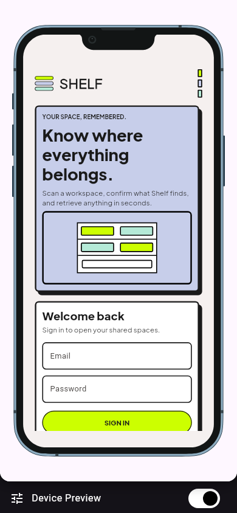
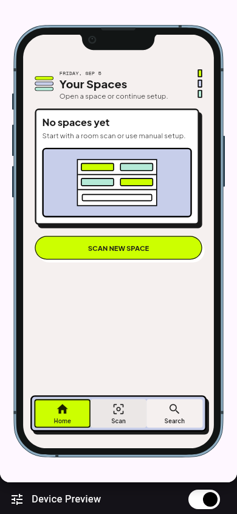
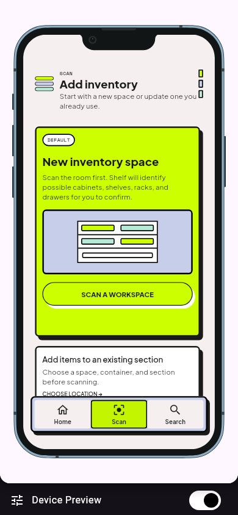
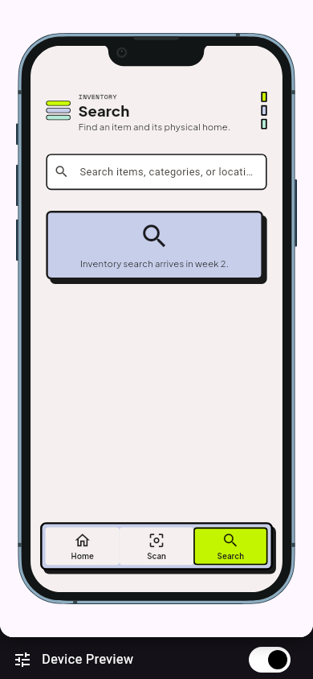
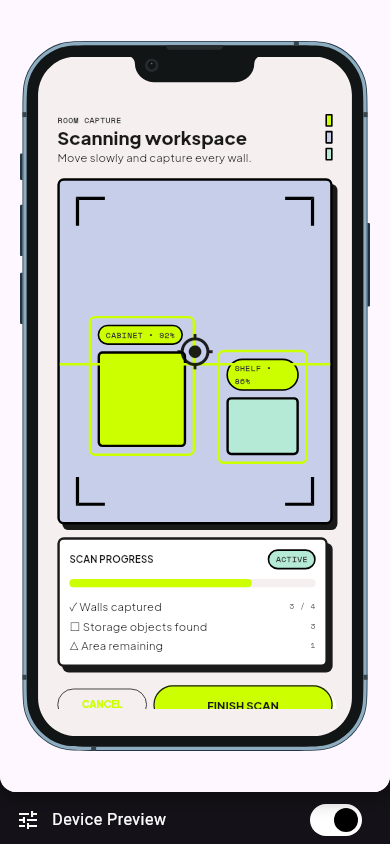
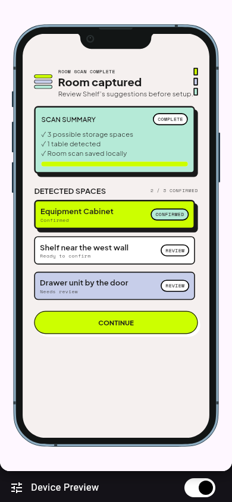
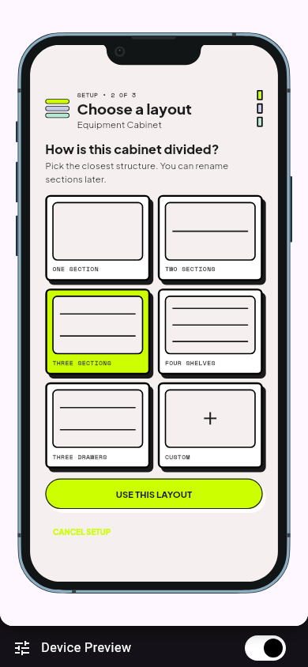
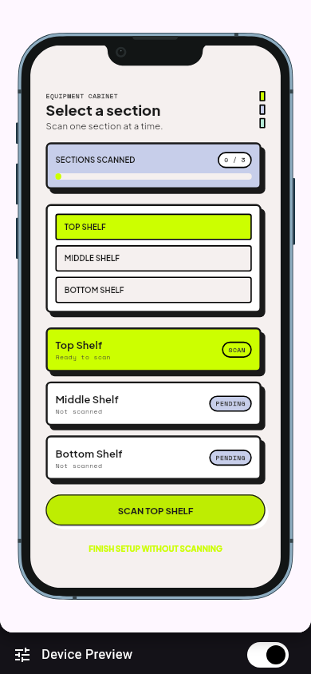
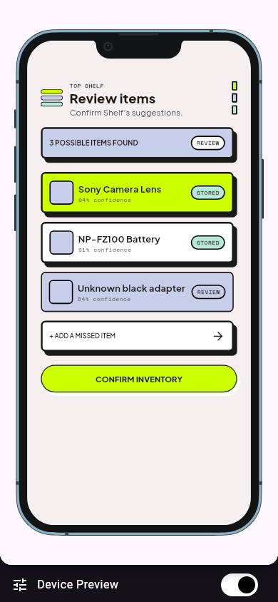

# Shelf

Shelf is a local-first inventory app for shared equipment rooms. It guides a
user through mapping a workspace, confirming storage sections and reviewing
possible items so equipment can be returned to a consistent physical home.

> Week 1 status: the visual shell and complete sample setup flow are working.
> Real scanning, persistent inventory records and search are still in progress.

## Screenshots

These screenshots were captured from the current Flutter web build at a
390 × 844 phone viewport.

| Sign in | Spaces | Add inventory |
| --- | --- | --- |
|  |  |  |

| Search | Room scan | Detected spaces |
| --- | --- | --- |
|  |  |  |

| Choose layout | Select section | Review items |
| --- | --- | --- |
|  |  |  |

## Features and usage

1. **Enter Shelf.** Fill both fields on the sign-in screen and select **Sign
   in**. This is a local Week 1 entry form, not a remote account system.
2. **Open the main shell.** The Home tab shows saved spaces and starts setup.
   The Scan tab contains the inventory actions, while Search currently shows
   its Week 2 placeholder.
3. **Start a workspace.** Select **Scan a workspace** to open the simulated
   room-capture screen, or use **Set up manually** to skip capture.
4. **Review the sample detection.** Finish the scan, review the suggested
   cabinet, then continue. Detected results are labelled as suggestions so the
   user can correct them.
5. **Choose the cabinet structure.** Select the closest layout and rename
   sections if needed.
6. **Review item candidates.** Scan the first section, review the three sample
   candidates and confirm the inventory.

The sample flow deliberately keeps a manual alternative available. It does not
claim to perform camera, RoomPlan or object-recognition work yet.

## Setup and installation

The verified development environment is:

- Flutter 3.44.4 (stable)
- Dart 3.12.2
- Chrome for interactive web development

From a new terminal:

```bash
git clone https://github.com/28BEANS/shelf.git
cd shelf
flutter pub get
flutter run -d chrome
```

When the app opens, the sign-in screen should show the Shelf logo, a lavender
introductory card and a local sign-in form. Any non-empty email and password can
be used for the current local demo.

To run without Flutter launching Chrome automatically:

```bash
flutter run -d web-server --web-port 8080
```

Then open `http://localhost:8080`. No API keys, backend URL or `.env` file are
required for the Week 1 build.

## Verification

```bash
flutter analyze
flutter test
flutter build web --release
```

Static analysis and all four automated tests pass. The tests cover required
sign-in fields, navigation into the app, the narrow-phone setup flow and a
file-backed Drift save/reopen/read/update cycle.

## Built with

| Area | Choice |
| --- | --- |
| UI | Flutter and Material widgets |
| State | Riverpod |
| Local storage | Drift with SQLite/Wasm support; the storage spike works, but setup state is not connected yet |
| Visual preview | Device Preview in debug builds |
| Typography | Bundled `Plus Jakarta Sans` and `Space Mono` font files, licensed under the SIL Open Font License |

## Project structure

```text
lib/
├── main.dart                 # application entry point
├── app.dart                  # MaterialApp and debug Device Preview
├── theme.dart                # colors, type and shared theme rules
├── data/                     # Drift database and generated schema code
├── models/                   # workspace, container, section and item models
├── screens/                  # sign-in, tab shell and setup flow
├── services/                 # replaceable scan-service boundary
├── state/                    # Riverpod providers and setup state
└── widgets/                  # reusable Shelf interface components
```

The project documents are in [`docs/`](docs/README.md), including the
[proposal](docs/01-proposal.md), [mockup](docs/02-mockup.md),
[design system](docs/03-design-system.md),
[weekly reports](docs/04-weekly-reports.md), and
[security and privacy checklist](docs/06-security-and-privacy.md).

## Privacy and secrets

The current build uses sample data and keeps its local database on the device;
nothing is sent to a backend. It needs no secrets, and the repository contains
no real API keys. The screenshots and sample flow use fictional room, account
and inventory data only.

## Known issues and next steps

- Setup progress currently lives in Riverpod memory and resets when the app is
  restarted. The tested Drift database is not connected to the setup flow yet.
- Room capture and item recognition return labelled sample candidates. Camera,
  permissions, iOS RoomPlan and LiDAR have not been validated on a compatible
  physical device.
- Search is a visible placeholder and there are no container overview, item
  detail, checkout, return or move-item flows yet.
- The sign-in form is only a local entry gate; it does not authenticate users.
- A deployed live URL and demo video are not available yet.

Next, the data model will be expanded into persistent workspace, container,
section and item records. The manual inventory path, overview screens, search
and item-location detail will be built before native scanning is attempted.

## AI use

AI-assisted tools were used for planning, implementation support, testing and
documentation. The disclosure and verification record is in
[`AI-USAGE.md`](AI-USAGE.md).

## Licence

MIT. See [`LICENSE`](LICENSE).
