# Shelf

[](AI-USAGE.md)

Shelf is an iPhone inventory app for a shared equipment room. It keeps room
views, storage locations, items, moves, and loans on one device so a user can
find equipment and return it to its home section. The current Shelf 2.0 build
uses Google registration through Supabase Auth and a six-digit passcode for
returning to that device. Inventory is not synced to Supabase. The Account
screen offers permanent deletion of the Shelf sign-in and saved device data.

**Source:** <https://github.com/28BEANS/shelf>
**Public browser demo:** <https://28beans.github.io/shelf/> — the earlier
manual-flow build. The current Google sign-in version has not been verified on
Pages, and the workflow is gated until public OAuth setup and a browser check
are complete.

## Setup and installation

I built this version with Flutter 3.44.4 and Dart 3.12.2. The iPhone build also
needs Xcode, CocoaPods, a personal Xcode development team, and a physical iPhone
for camera scanning.

```bash
git clone https://github.com/28BEANS/shelf.git
cd shelf
flutter pub get
cp .env.example .env
```

Set `SUPABASE_URL` and `SUPABASE_PUBLISHABLE_KEY` in the ignored `.env`.
The device build script also accepts `URL` and `PUBLIC_KEY`. Use only the
publishable client key; never put the Supabase secret key, database password, or
connection URI in Flutter or Git. In Supabase, enable Google Auth with a Google
Cloud Web application OAuth client. Add the callback URL shown by Supabase to
the Google client's authorized redirect URIs, and add
`app.shelf.inventory.visual://login-callback/` to Supabase Auth's redirect
allow list. These settings live outside this repository. Before using account
deletion, apply the [account deletion migration](supabase/migrations/20261009000000_delete_my_account.sql)
to the same Supabase project. It creates the authenticated
`delete_my_account` function; without it, the app cannot complete deletion.

## How to run it

Connect an iPhone with Developer Mode and configure Xcode signing. Find its
device ID with `flutter devices`, then install the separate Shelf 2.0 bundle:

```bash
tools/run_shelf_visual_device.sh <iPhone-device-ID>
```

Use `tools/run_shelf_visual_device.sh --build-only` for a signed build without
installation. The script creates a temporary copy with a distinct bundle ID,
so the original Shelf installation remains separate. The installed app is
labelled **Shelf**. On first launch, choose **Continue with Google**, create
and confirm a six-digit passcode, then unlock. Later launches return to the
passcode screen.

A simulator can show non-camera screens but cannot verify room tracking or
camera results. The public browser link is the earlier manual demo. A fresh
local Chrome run of this source needs public OAuth values passed as Dart
defines and working web redirect configuration; that complete browser
sign-in path has not yet been verified.

## Features and usage

1. Register with Google, set the device passcode, and unlock the local workspace.
2. Create a workspace. Capture room photos on iPhone or use the manual setup
   route. Review observations, name storage containers, choose layouts, and
   adjust sections before saving.
3. Open a saved room photo view to place or move storage pins. Move pins off a
   view before deleting that photo. The view is a labelled image, not a textured
   3D room model.
4. Add an item to a section manually, or capture an item photo and review/edit
   the OCR suggestion before accepting it.
5. Search by item, model, identifier, category, or location. Item details show
   both current and home sections.
6. Move an item, check it out with borrower and due date, or return it. Shelf
   keeps movement and loan history in local Drift/SQLite records.
7. Open **Account settings** from the Spaces home screen to review account
   controls. **Delete account** asks for confirmation, then deletes the
   authenticated Shelf user from Supabase, clears the local passcode and
   session, and removes saved workspace, inventory, loan, scan, and photo data
   from this device. It returns to registration. This requires a live Supabase
   connection and the migration above. It does not delete the Google account.

## Screenshots

These iPhone screenshots show the Shelf 2.0 sign-in and inventory flow, plus
the current empty home and Account screen. The populated Spaces home image is
from the earlier UI; the live AR camera scan is from the earlier scanning build.

| Passcode unlock | Google registration | Launch screen |
| --- | --- | --- |
| 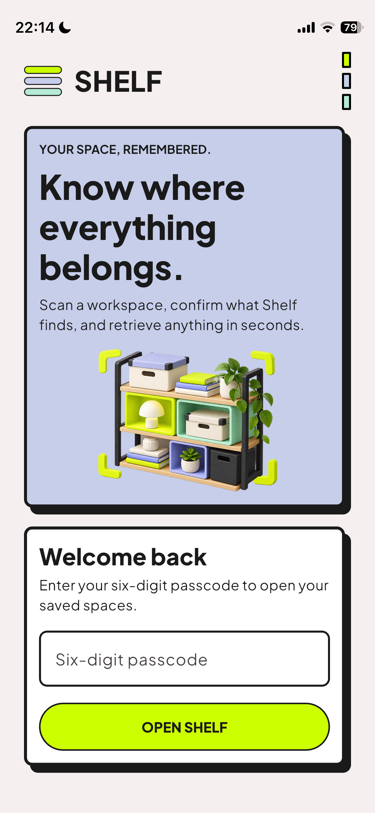 | 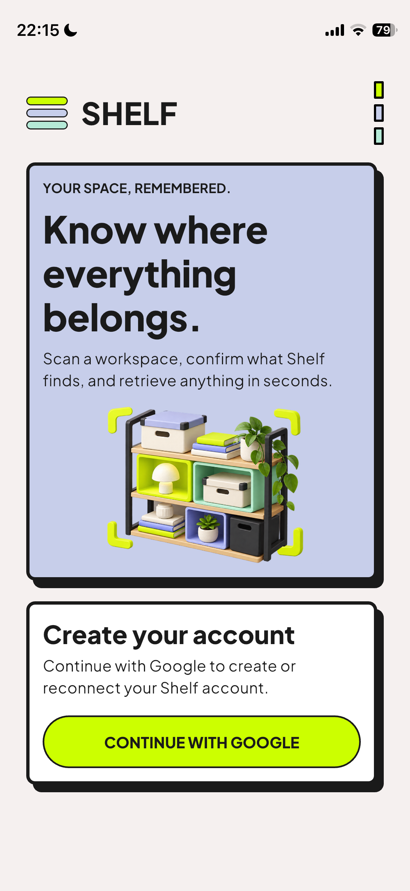 | 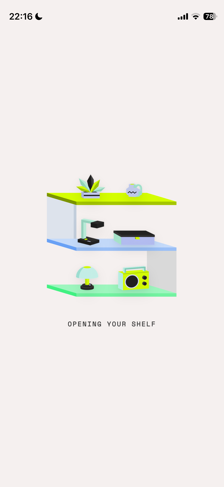 |

| Populated Spaces home (earlier UI) | Add inventory | Saved room photo view |
| --- | --- | --- |
| 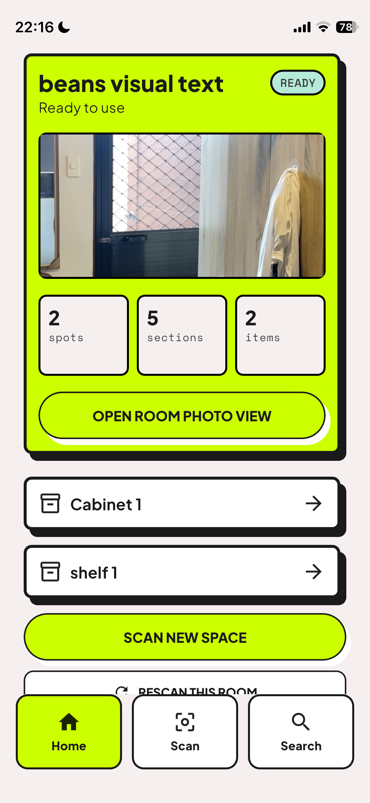 | 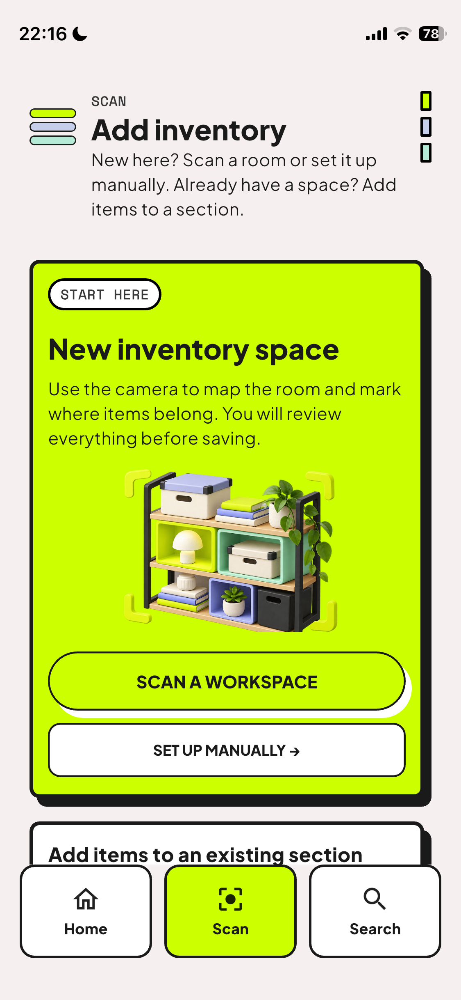 | 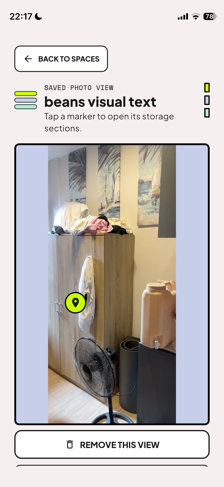 |

| Container sections | Item details | Check out item |
| --- | --- | --- |
| 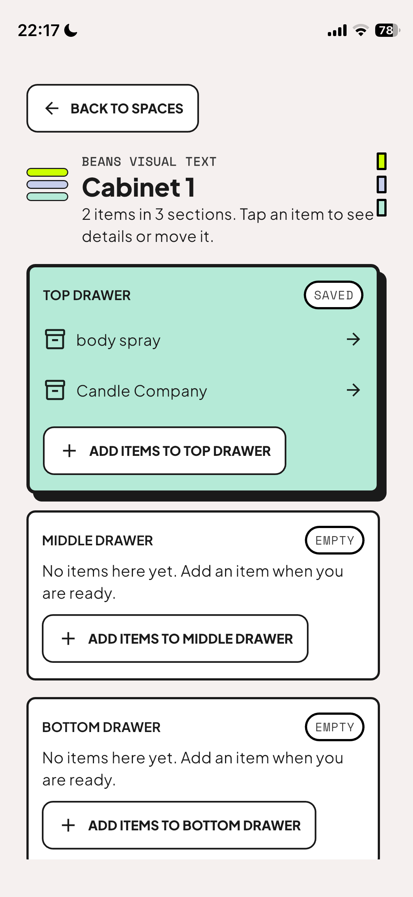 | 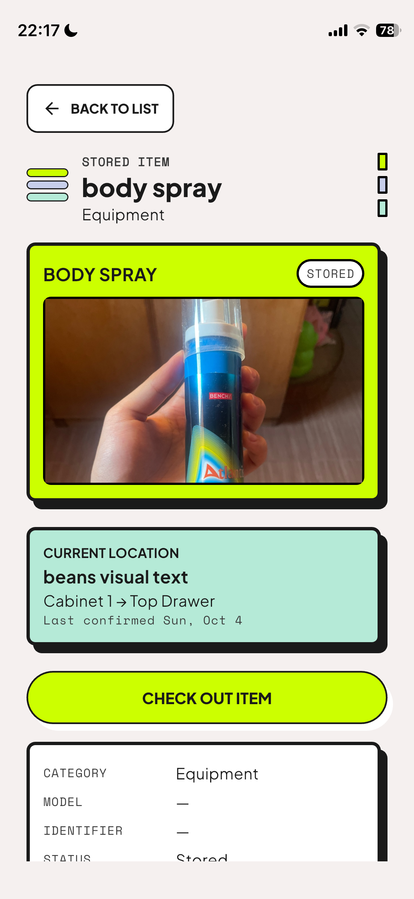 | 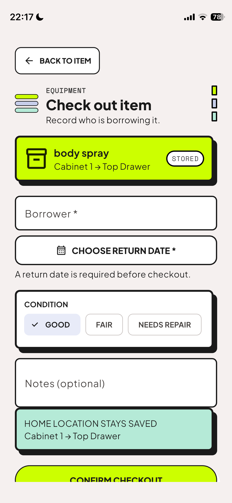 |

| Inventory search | Live AR camera scan (earlier build) |
| --- | --- |
| 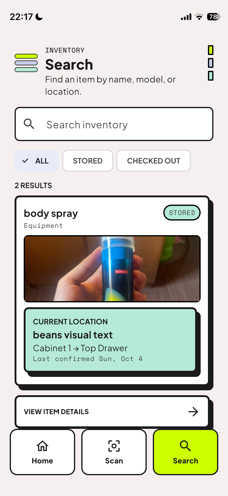 |  |

| Empty Spaces home | Account deletion screen |
| --- | --- |
| 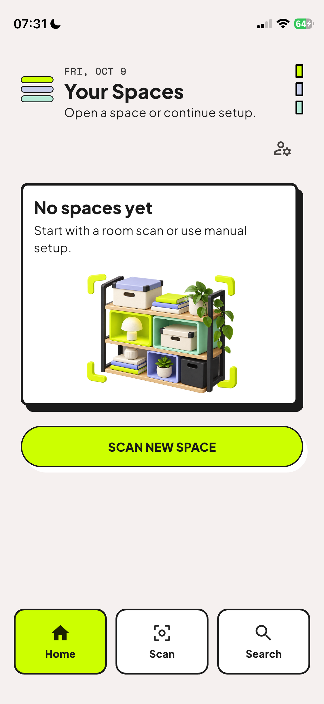 | 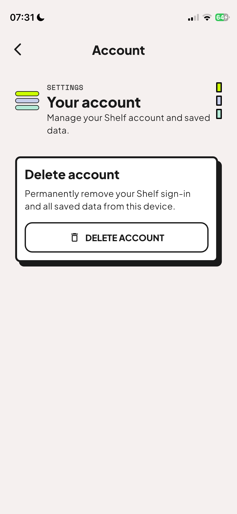 |

## Current limits and next steps

The iPhone 12 mini test confirmed a real camera feed, room-plane tracking,
manual storage marks, OCR suggestions, saved items, and retained data after
relaunch. It did not establish automatic shelf/cabinet recognition. The active
Shelf 2.0 room experience is photo-backed and does not use LiDAR or produce a
textured 3D model. OCR needs human review. Barcode capture, scanner failure
cases, and a full write-path validation audit remain open.

The gallery above includes current Shelf 2.0 screens and one earlier live AR
camera image. The Account screenshot shows the entry point, not proof that the
server deletion completed. The final demo video, slides, and square image
remain open. The public Pages build still shows the earlier browser demo.

## Project structure

```text
lib/
├── main.dart                 # Supabase initialization and app entry
├── app.dart                  # app setup and database providers
├── theme.dart                # colors, typography, and shared styles
├── data/                     # Drift schema and inventory repository
├── models/                   # workspace, scan, item, and loan records
├── screens/                  # entry, setup, photo view, inventory, and loans
├── services/                 # Google/passcode auth and iOS scan bridge
├── state/                    # Riverpod providers and setup state
└── widgets/                  # reusable controls, images, and navigation
supabase/migrations/           # authenticated account deletion function
```

## Verification and project records

The source was checked on October 9 with `flutter analyze` and 18 Flutter
tests, including confirmation and local-data clearing for account deletion.
These automated tests use a fake auth gateway; they do not verify the live
Supabase deletion function. The owner previously verified Google registration,
passcode unlock after relaunch, retained workspace, and the illustration drag
response on an iPhone 12 mini. The October 4 release web build check was not
an OAuth browser test.

- [Week 3 implementation report](docs/04-weekly-reports.md)
- [Security checklist](SECURITY-CHECKLIST.md) and [privacy notes](docs/06-security-and-privacy.md)
- [Proposal](docs/01-proposal.md), [mockup](docs/02-mockup.md), and [design system](docs/03-design-system.md)
- [Visual scan scope and remaining work](docs/07-visual-scan-implementation-plan.md)

**AI use:** I used ChatGPT Codex extensively for implementation, tests, and
documentation, plus image generation for the login artwork. I set the
requirements, reviewed the results, and tested the device flow. The
[AI usage record](AI-USAGE.md) gives feature commits, mistakes, and authorship
details. Shelf is MIT licensed; see [LICENSE](LICENSE).
