# Mockup and wireframes

The visual plan for Shelf. The screen flow starts with workspace setup, moves
through section-based inventory capture, and ends with search and item lifecycle
actions.

## Mockup

The complete reference document is available as [Shelf mockup (PDF)](assets/shelf-mockup.pdf).
The exported screens below are kept individually so a reviewer can inspect the
flow without opening the PDF.

### Entry and workspace setup

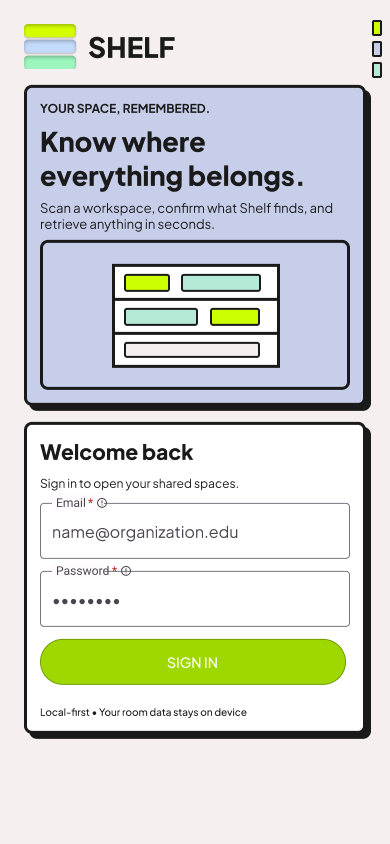

*Figure 1. Login and entry state.*

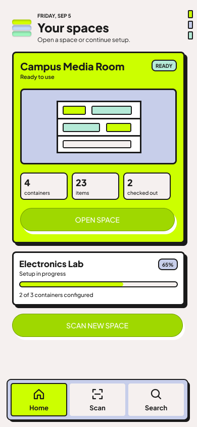

*Figure 2. Home and Spaces.*

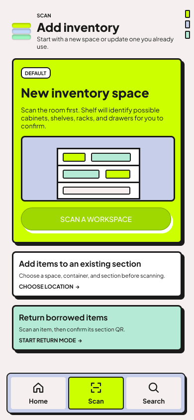

*Figure 3. Start a new inventory space.*

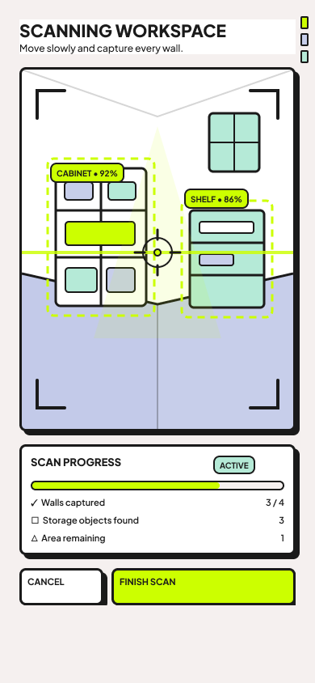

*Figure 4. Capture the room and detect storage spaces.*

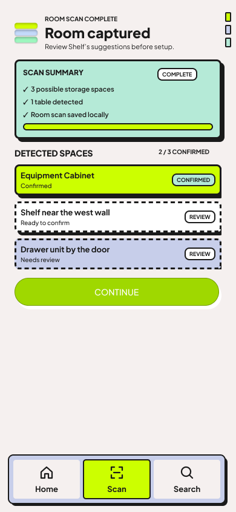

*Figure 5. Review detected spaces before saving them.*

### Container and section setup

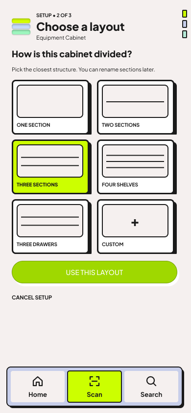

*Figure 6. Choose a shelf, drawer, or custom layout.*

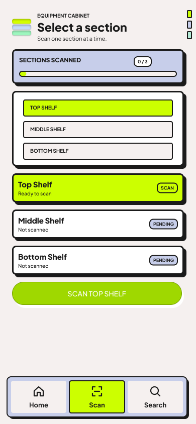

*Figure 7. Select the section to scan.*

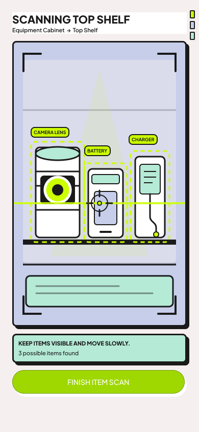

*Figure 8. Scan the contents of one known section.*

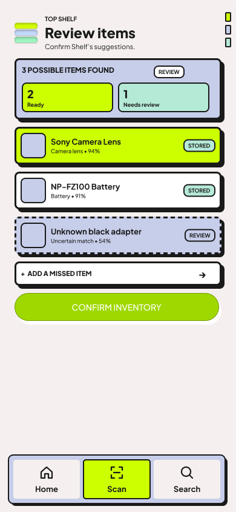

*Figure 9. Review and correct suggested item records.*

### Browse and item lifecycle

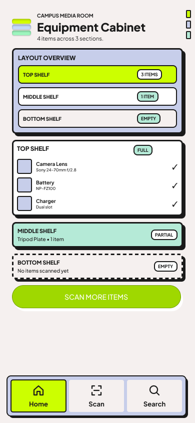

*Figure 10. See sections, item counts, and setup state.*

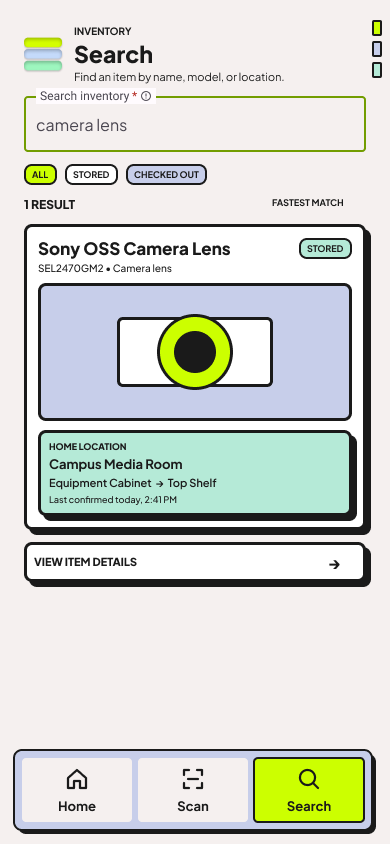

*Figure 11. Search the inventory and filter results.*

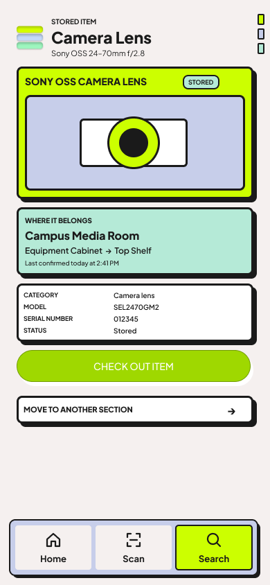

*Figure 12. View status, identifiers, and physical location.*

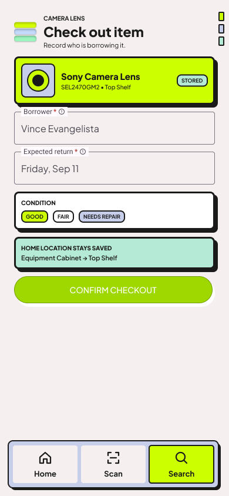

*Figure 13. Record a check-out.*

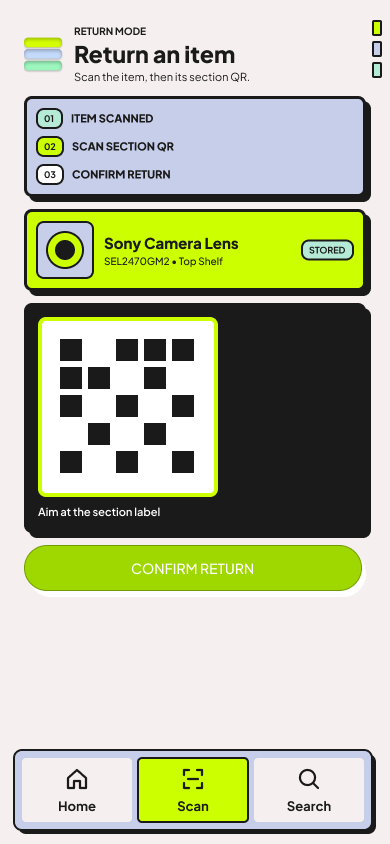

*Figure 14. Confirm an item return.*

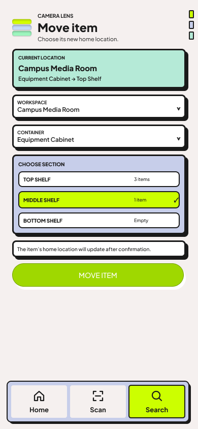

*Figure 15. Move an item while preserving its history.*

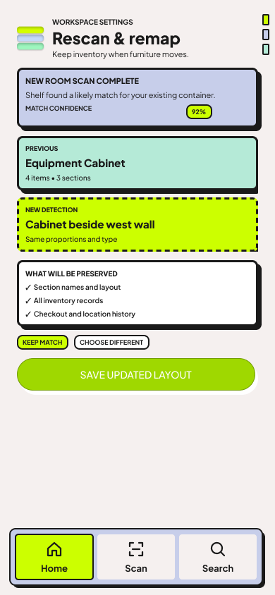

*Figure 16. Review a later room rescan and remap suggestions.*

## Wireframes

The wireframe-level flow is intentionally linear: every scan produces a review
state before data is committed, and every automated path has a manual alternative.

```text
Login
  -> Home / Spaces
  -> Scan or New Space
  -> Room Scan
  -> Detected Spaces
  -> Choose Layout
  -> Select Section
  -> Scan Items
  -> Review Items
  -> Container Overview
  -> Search -> Item Detail
                    -> Check Out Item
                    -> Return Item
                    -> Move Item

Later maintenance: Home / Spaces -> Rescan and Remap
```

The mockup exports above are the current screen-level visual reference. The
implementation will keep one primary action per screen and make uncertain
detections explicit instead of silently saving them.

## Screens

### Login

Introduces Shelf and lets the user enter the local workspace experience. In the
MVP this is an entry state rather than a server-backed account system.

### Home and Spaces

Shows the current workspace, existing storage spaces, and the actions to open a
space, search inventory, or start a new scan.

### Scan or New Space

Lets the user choose between creating a space from a room scan, scanning an
existing section, or using the manual fallback.

### Room Scan

Guides the room capture, shows progress, and finishes with a reviewable set of
detected storage objects.

### Detected Spaces

Lists suggested containers with confirmed and review states. The user can rename,
retype, remove, or manually add a container before continuing.

### Choose Layout

Offers one, two, or three sections, shelf and drawer templates, and a custom
layout. Choosing one generates the container's logical sections.

### Select Section

Shows the generated sections and their setup progress. Selecting a section starts
the item-capture path for that physical location.

### Scan Items

Captures one open section at a time and displays in-context detection labels. The
user can finish the scan or add an item manually.

### Review Items

Shows suggested names and metadata with confidence or review state. Accept, edit,
remove, and manual-add actions all return to the selected section.

### Container Overview

Shows the hierarchy and occupancy state for the selected container. The user can
scan more items, edit the layout, open a section, or view the container in the
room when that capability is available.

### Search

Searches item names, categories, identifiers, containers, and sections. Results
show enough location context to decide whether to open item details.

### Item Detail

Shows the item image, identifying details, current status, home location, current
location, and last-confirmed time. It is the entry point for check-out, return,
and move actions.

### Check Out Item

Records the borrower, expected return, condition, and notes. The item status
changes without deleting its saved home section.

### Return Item

Confirms the item, optionally using a section QR label later, then restores the
available state and updates the confirmation timestamp.

### Move Item

Lets the user select a new section and keeps the original home location and
movement history available for accountability.

### Rescan and Remap

Compares a new room scan with existing logical containers, shows match confidence,
and lets the administrator keep a match or choose a different container. This is
planned after the core inventory path.
