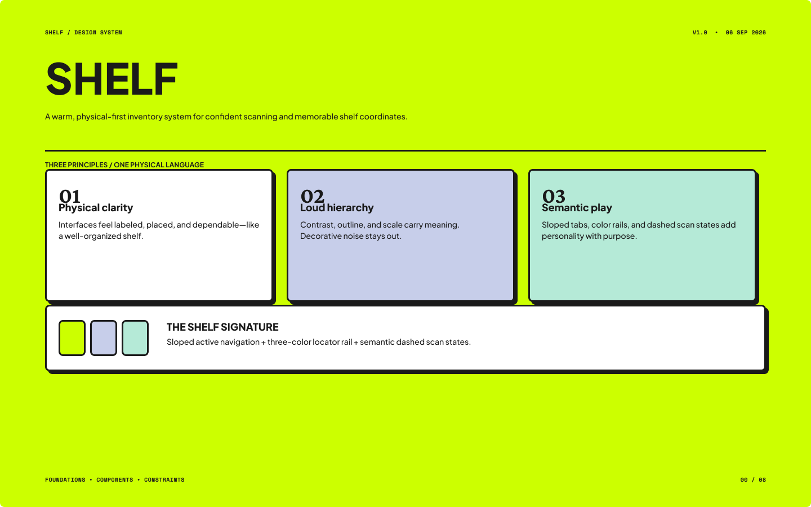
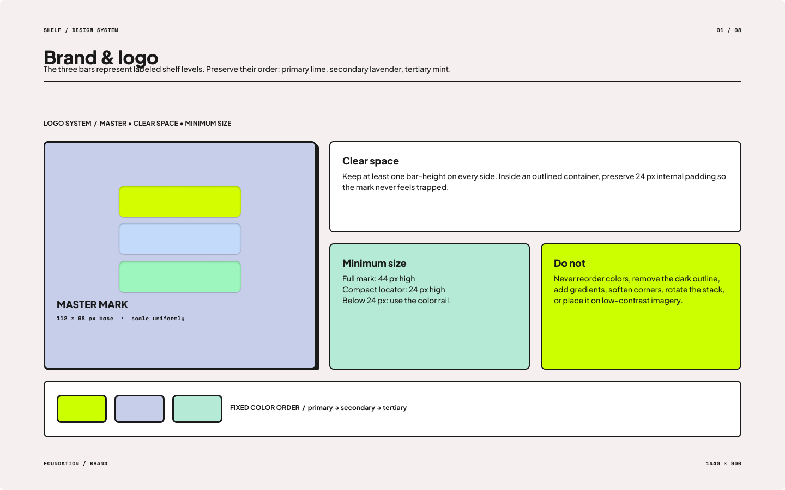
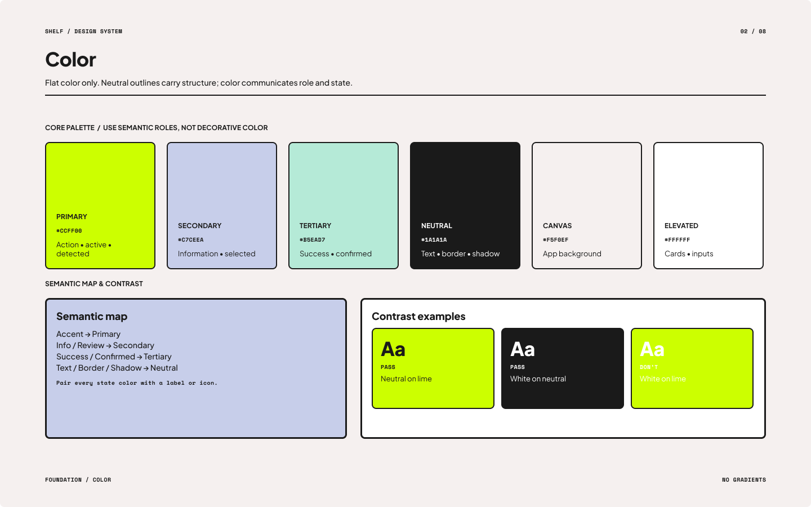
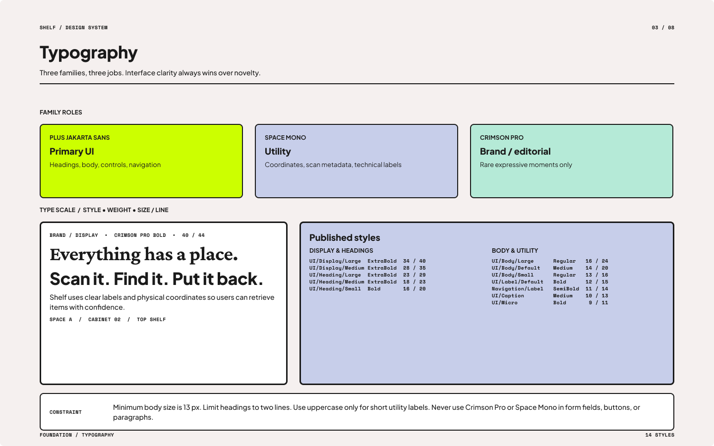
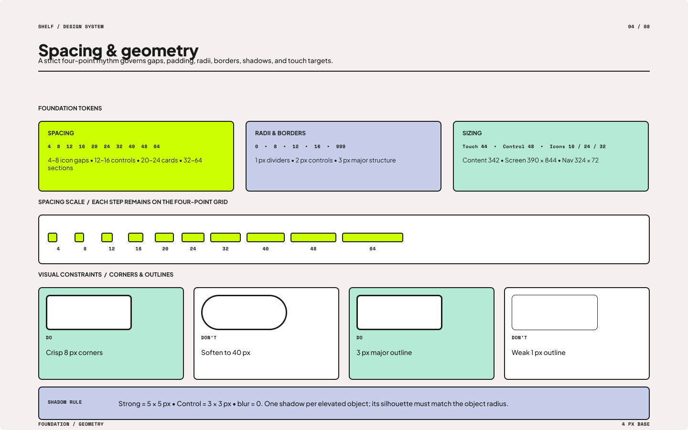
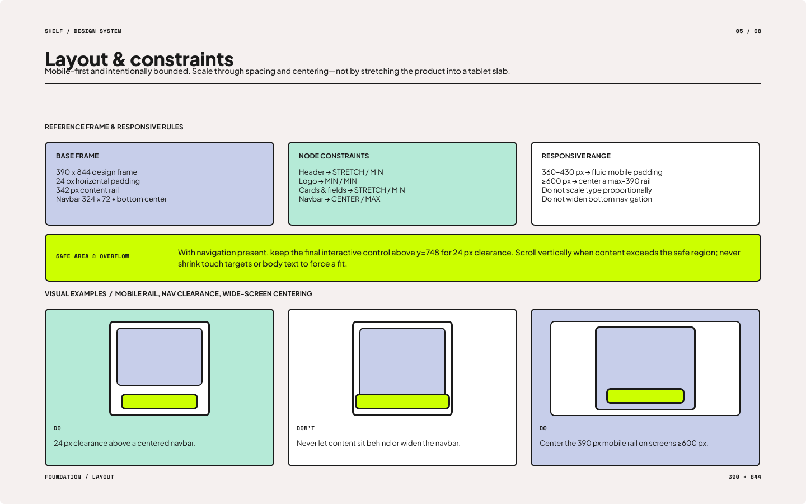
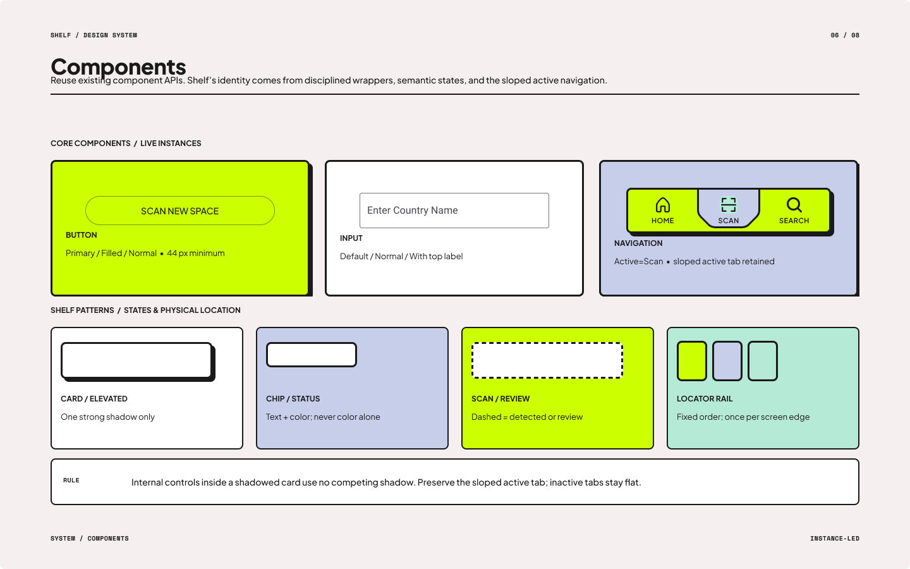
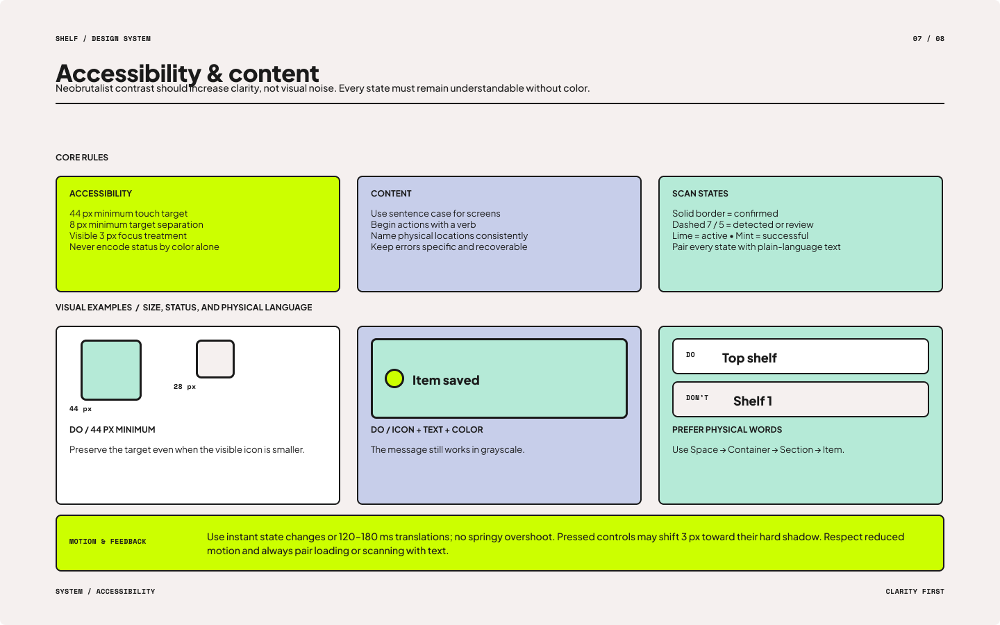
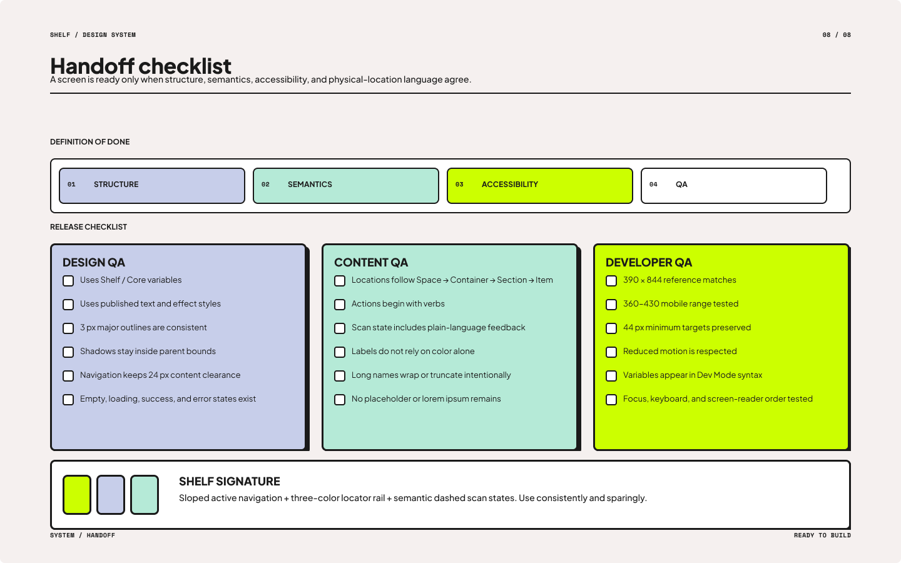

# Design system

Shelf uses a warm, physical-first visual language for a searchable equipment
inventory. The system is organized around three principles: physical clarity,
loud hierarchy, and semantic meaning.

The complete visual reference is available as [Shelf design system (PDF)](assets/shelf-design-system.pdf).
The source visual sheets are also available for the brand, color, typography,
spacing, layout, components, accessibility, and handoff sections below.

## Palette

The palette uses lime for primary action and active states, lavender for review
and selected states, mint for confirmed or successful states, and near-black for
text and outlines. Surfaces stay white or warm off-white so the storage hierarchy
remains legible.

| Role | Value | Use |
| --- | --- | --- |
| Primary | `#CCFF00` | Main buttons, active navigation, detections |
| On primary | `#1A1A1A` | Text and icons on lime |
| Secondary | `#C7CEEA` | Review and selected states |
| Tertiary | `#B5EAD7` | Confirmed and success states |
| Surface | `#FFFFFF` | Cards, sheets, and dialogs |
| Background | `#F5F0EF` | App background |
| On surface | `#1A1A1A` | Body text, icons, and borders |
| Error | `#BA1A1A` | Validation and destructive actions |

The first implementation is light mode only. Widgets read from `Theme.of(context).colorScheme`
instead of defining their own literal colors.

## Type scale

Plus Jakarta Sans is the primary interface family. Space Mono is reserved for
compact metadata such as coordinates, timestamps, and scan labels.

| Style | Flutter slot | Size | Weight | Use |
| --- | --- | ---: | ---: | --- |
| Heading | `headlineSmall` | 28 | 800 | Screen titles and primary headings |
| Body | `bodyMedium` | 16 | 400 | Descriptions, form content, item details |
| Caption | `labelSmall` | 12 | 500 | Timestamps, hints, scan metadata |
| Action label | `labelLarge` | 14 | 700 | Buttons, tabs, important controls |

## Spacing

Shelf follows a four-point grid. Screen content uses a 24 px edge rail, list
items use a 12 px gap, and major sections use a 32 px gap.

| Token | Value | Use |
| --- | ---: | --- |
| `AppSpacing.xs` | 4 px | Base unit |
| `AppSpacing.sm` | 8 px | Tight internal spacing |
| `AppSpacing.listItem` | 12 px | Card and list gaps |
| `AppSpacing.md` | 16 px | Default component padding |
| `AppSpacing.lg` | 24 px | Screen edge padding |
| `AppSpacing.section` | 32 px | Major content groups |

Cards use an 8 px radius, a 3 px near-black outline, and no elevation. Controls
should maintain comfortable touch targets and preserve the visual rail on narrow
phone layouts.

## Components

Reusable widgets receive models, values, and callbacks from their parent. They do
not own page state or call `setState`. Constructors should be `const` whenever
their fields allow it.

| Widget | File | Main parameters | Used on |
| --- | --- | --- | --- |
| `PrimaryActionButton` | `lib/widgets/primary_action_button.dart` | `label`, optional `icon`, `onPressed` | Welcome, setup, scan, loan, return |
| `ShelfTextField` | `lib/widgets/shelf_text_field.dart` | `label`, controller, validator, `onChanged` | Workspace, container, section, item forms |
| `ShelfBottomNavigation` | `lib/widgets/shelf_bottom_navigation.dart` | `currentIndex`, `onDestinationSelected` | Home, Spaces, Search, Activity |
| `SectionCard` | `lib/widgets/section_card.dart` | section, `itemCount`, `onTap` | Container setup and section inventory |
| `ItemLocationCard` | `lib/widgets/item_location_card.dart` | item, `onTap` | Search, inventory, checkout selection |
| `StatusChip` | `lib/widgets/status_chip.dart` | label, `ItemStatus` | Detail, cards, loan history, scan review |
| `ScanCandidateTile` | `lib/widgets/scan_candidate_tile.dart` | candidate, accept/edit/remove callbacks | Section scan review |
| `EmptyState` | `lib/widgets/empty_state.dart` | title, message, icon, optional action | Empty search, section, activity, workspace |

## Theme assembly

`lib/theme.dart` is the single source of truth for the color scheme, text theme,
card shape, scaffold background, and button defaults. It will use a hand-written
Material `ColorScheme` so the established lime, lavender, and mint roles are not
replaced by an automatically generated seed palette. The theme will also load
Plus Jakarta Sans and Space Mono through `google_fonts`.

## Accessibility and content

Every screen should have a clear primary action, readable labels, visible focus
and validation states, and concise confirmation feedback. Lime is not used as the
only signal: status, review, and error states also use text, shape, or icon
support. Contrast is checked for text on the warm background, white surfaces,
and lime controls.

## Changes since the last version

- **September 20, 2026:** Converted the visual palette into semantic Material
  roles and established a light-only theme so screens do not hardcode colors.
- **September 20, 2026:** Reduced the type guidance to four implementation-ready
  text slots and reserved Space Mono for metadata rather than general body copy.
- **September 20, 2026:** Turned the four-point spacing grid into named
  `AppSpacing` tokens and documented the first reusable widget contracts so UI
  work can proceed consistently in week one.
